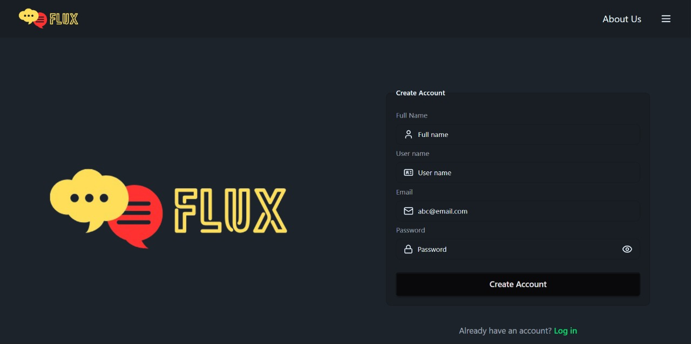
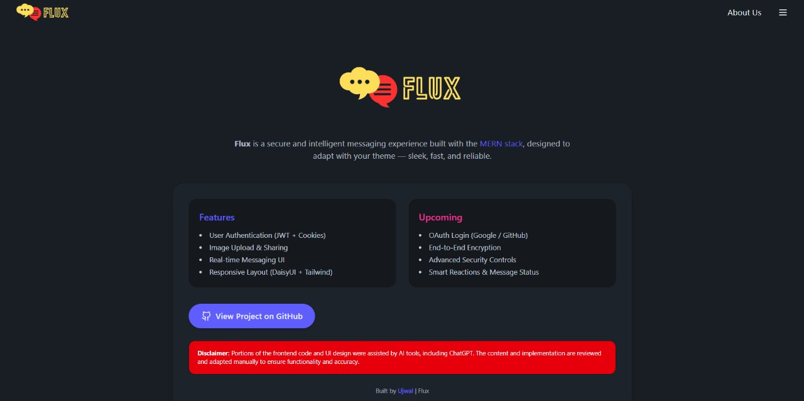
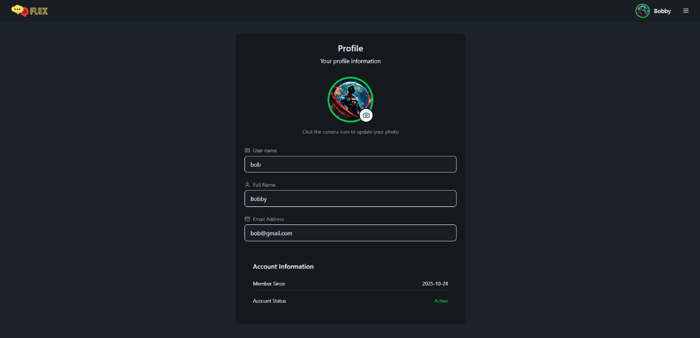
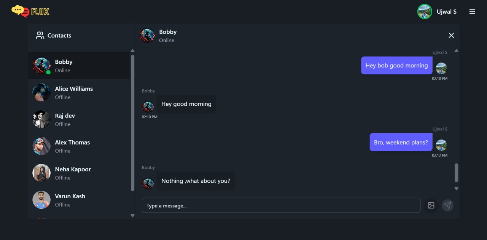
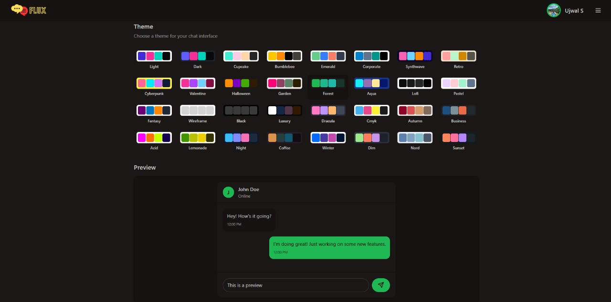

# ⚡ Flux V1 — Real-Time MERN Chat Application

Flux V1 is a **real-time communication platform** built using the **MERN stack** with a modern UI powered by **Tailwind CSS** and **DaisyUI**.  
It enables secure, responsive, and visually appealing communication between users, featuring **JWT authentication**, **image sharing**, and **cloud-based media storage**.

---

## Features

User Authentication (JWT with HTTP-only cookies)  
Profile Picture Upload using **Cloudinary**  
Real-time Messaging Experience  
Online/Offline Presence Indicators
Image Sharing in Chats  
Responsive Modern UI (DaisyUI + Tailwind)  
Toast Notifications for User Feedback  
State Management using **Zustand**  
Dynamic Theme Support (Light/Dark mode)

---

## Tech Stack

### **Frontend**

- React 19 (Vite)
- Tailwind CSS + DaisyUI
- Framer Motion (Animations)
- React Hot Toast (Notifications)
- Zustand (State Management)
- Lottie React (Animated Loaders)
- React Router DOM
- Axios for API Requests
- Lucide React (Icon Library)

### **Backend**

- Node.js + Express
- MongoDB + Mongoose
- JSON Web Tokens (JWT)
- Cloudinary (Media Storage)
- Multer (File Upload Handling)
- Bcrypt (Password Hashing)
- CORS + Cookie Parser
- Dotenv for Environment Variables

  ## Folder Structure

  ```
  flux-v1/
  │
  ├── backend/
  │   ├── src/
  │   │   ├── controllers/
  │   │   ├── db/
  │   │   ├── models/
  │   │   ├── routers/
  │   │   ├── middleware/
  │   │   ├── utils/
  │   │   └── index.js    -Entry point for backend
  │   ├── public/
  │   ├── package.json
  │   ├── package-lock.json
  │   └── README.md
  ├── frontend/
  │   ├── src/
  │   │   ├── components/
  │   │   ├── constan
  │   │   ├── assets/
  │   │   ├── pages/
  │   │   ├── store/
  │   │   ├── utils/
  │   │   ├── App.jsx     -Entry point for frontend
  │   │   └── index.css
  │   ├── public/
  │   ├── index.html
  │   ├── package.json
  │   ├── package-lock.json
  │   ├──.gitignore
  └── README.md
  ```

  ## Installation & Setup -Locally

  ### Clone the repository

  ```bash
  git clone https://github.com/ujwals05/flux-v1.git
  cd flux-v1
  ```

  ### Set-up Backend

  ```
  cd backend
  npm install
  ```

  ### Create a .env file in the backend directory:

  ```
  PORT=5000
  MONGO_URI=your_mongodb_connection
  JWT_SECRET=your_secret_key
  CLOUDINARY_CLOUD_NAME=your_cloud_name
  CLOUDINARY_API_KEY=your_api_key
  CLOUDINARY_API_SECRET=your_api_secret
  CORS_ORIGIN=http://localhost:5173
  ```

  ### Start backend

  ```
  npm run dev
  ```

  ### Set-up Front-end

  ```
  cd frontend
  npm install
  npm run dev
  ```

  ## Pre-view:

  <h2 align="center">🖼️ Application Previews</h2>

<p align="center">
  
</p>

<p align="center">
  
</p>

<p align="center">
  
</p>

<p align="center">
  
</p>

<p align="center">
  
</p>

## Upcoming Features (Flux V2)

- Google / GitHub OAuth Login
- End-to-End Message Encryption
- Message Privacy & Security Enhancements
- File & Video Sharing
- AI-Powered Smart Replies
- Group Chats
- Community
